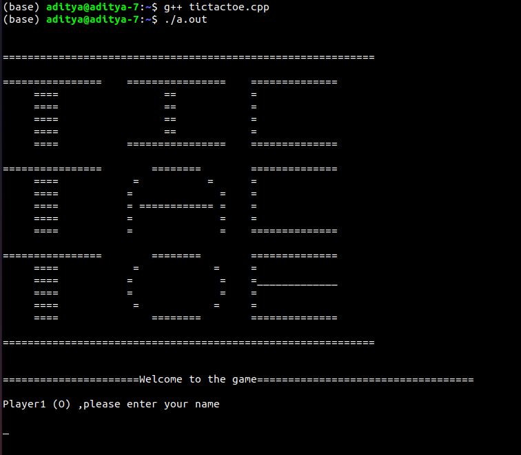
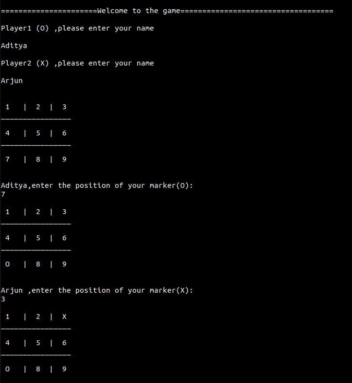
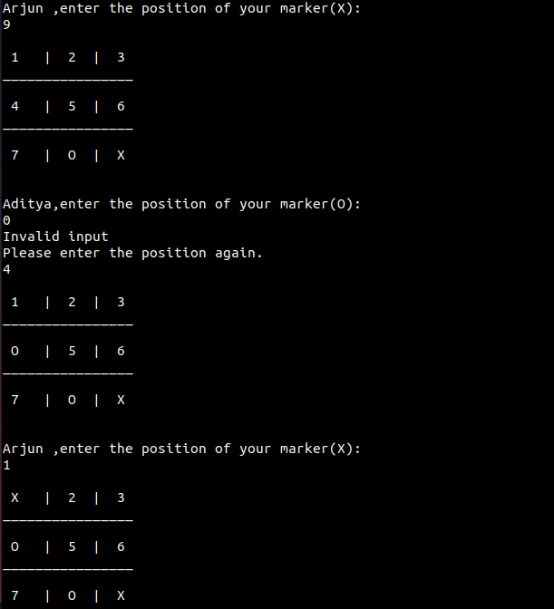
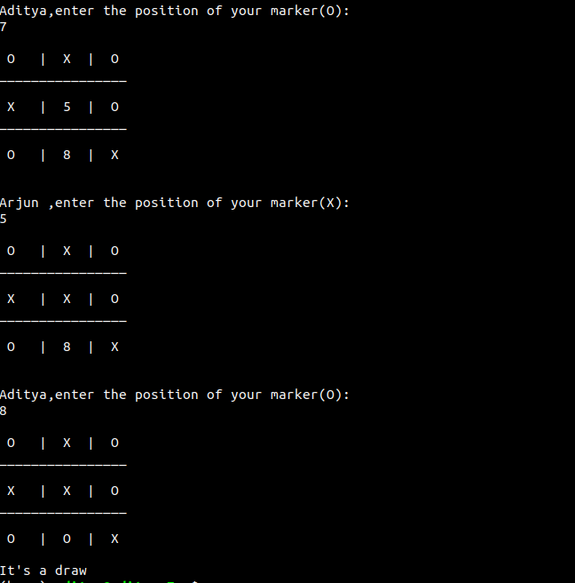

# TICTACTOE

# Description

TIC TAC TOE using command line interface. It is a simple implementation of famous TIC TAC TOE game. Each player can provide its name. The players will be asked to provide marker position on the board. The player which gets 3 subsequent markers in a row,column or a diagonal wins the game.

# Rules of the game:
   https://en.wikipedia.org/wiki/Tic-tac-toe

## User Interface:

On initialisation of the game, a board of 3 * 3 matrix will appear.Each cell of the matrix will represent a position starting with 1 at leftmost top corner.

After that, users will be prompted to provide their names.Each player will be asked to give the positions for their marker. Player 1 will have marker O and Players will have X .

If a player provides a position , other than 1 to 9 , the player will be prompted to re-enter the position along with appropriate message.If a player enters a position which is already taken by a marker then player will be asked to enter the position again.

The player to get 3 markers positioned in a straight line is declared the winner.

If no player is able to get 3 markers in a straight line then the game has drawn.

## Command:
### Linux distributions:
              g++ tictactoe.cpp
              ./a.out
